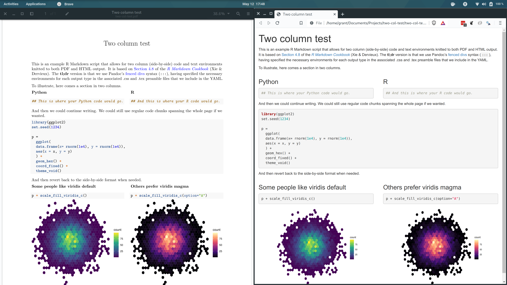

# Two column R Markdown code sections (both PDF and HTML)

This repo contains a short .Rmd file plus a few accessories, demonstrating how to obtain two (i.e. side-by-side) column sections for both PDF and HTML output. This is useful if you are comparing code chunks between different languages for example, and plan to make your notes available in multiple formats.

The resulting PDF (left) and HTML (right) files are shown below. Note that you will still have to knit each output file individually (e.g. by opening the .Rmd file in RStudio and clicking "Knit to PDF" and "Knit to HTML").

